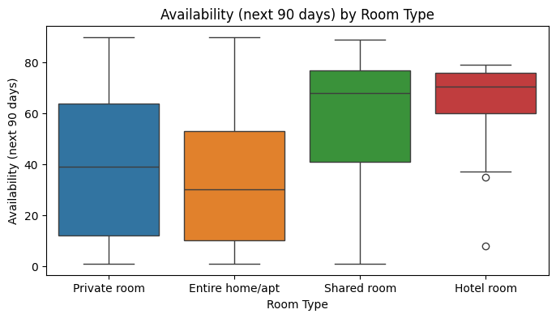
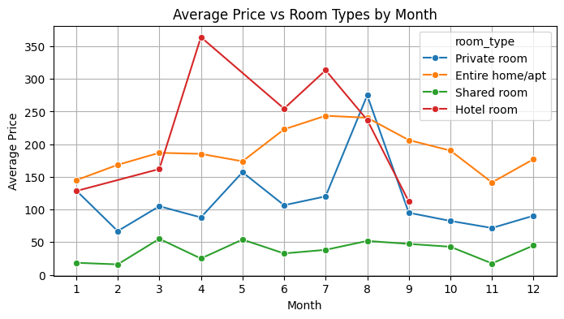
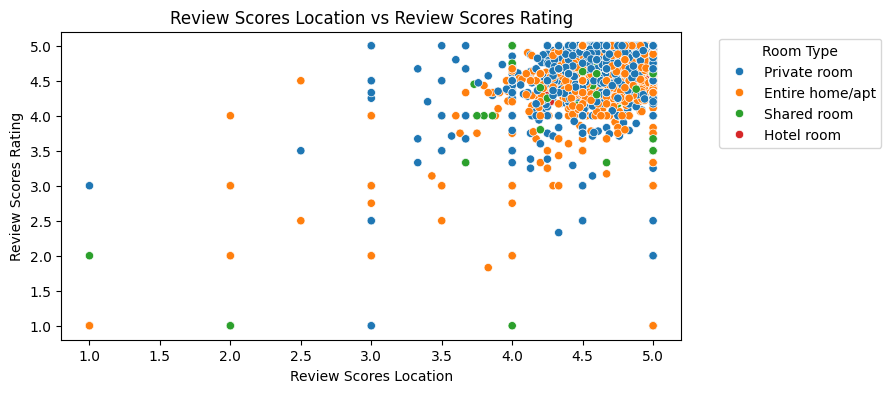
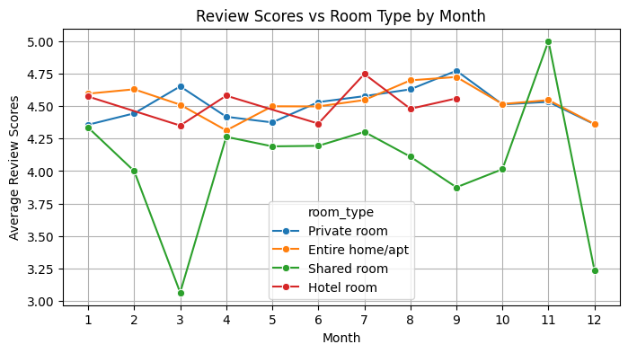

# Airbnb Data Analysis with Python

## Project Overview

This project explores Airbnb listing data using Python, Pandas and visualization techniques to identify pricing patterns, room type trends and customer review behavior.

The analysis was developed as part of a Python programming and data analytics academic project.

---

## Tools & Libraries

- Python
- Pandas
- Matplotlib
- Seaborn
- Jupyter Notebook

---

## Dataset

The dataset contains Airbnb listing information including:

- Room type
- Price
- Review scores
- Availability
- Number of reviews
- Neighborhood information

---

## Key Questions

- Which room type has the highest average prices?
- Is there a relationship between reviews and pricing?
- How does availability vary between room types?
- What patterns can be identified in customer ratings?

---

## Visualizations

### Availability by Room Type



---

### Average Price vs Room Types by Month



---

### Review Scores by Room Type


---

### Review Scores Correlation



---

### Review Scores by Room Type per Month



---

## Repository Structure

```text
airbnb-data-analysis-python/
│
├── notebooks/
├── data/
├── images/
├── src/
├── requirements.txt
└── README.md
